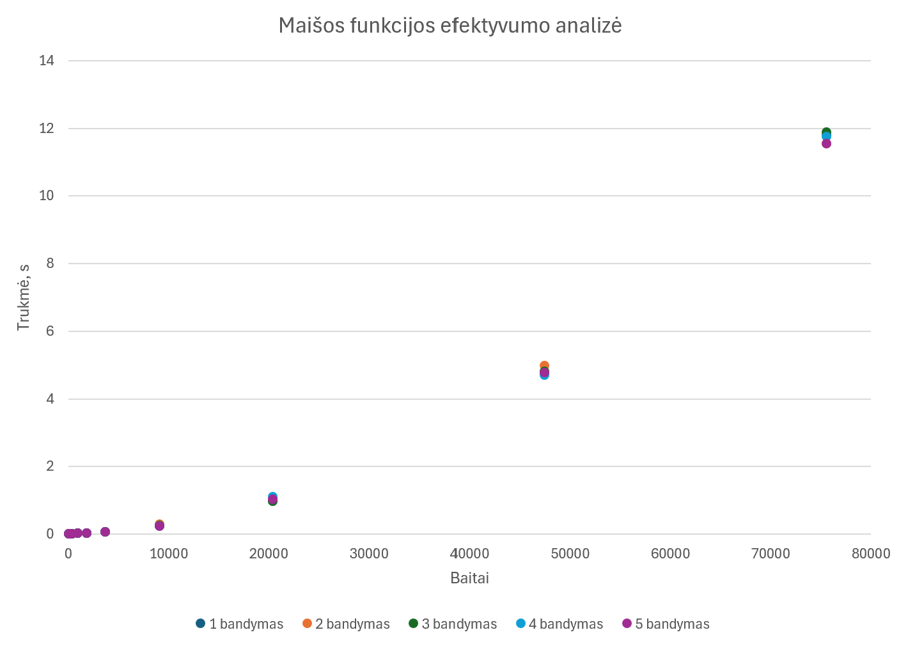
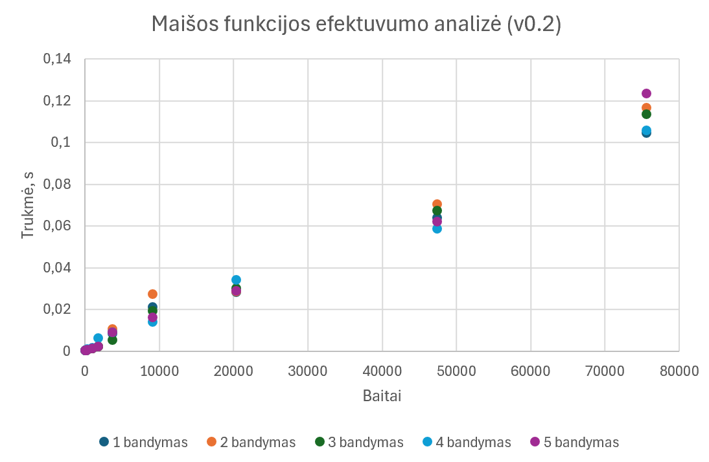
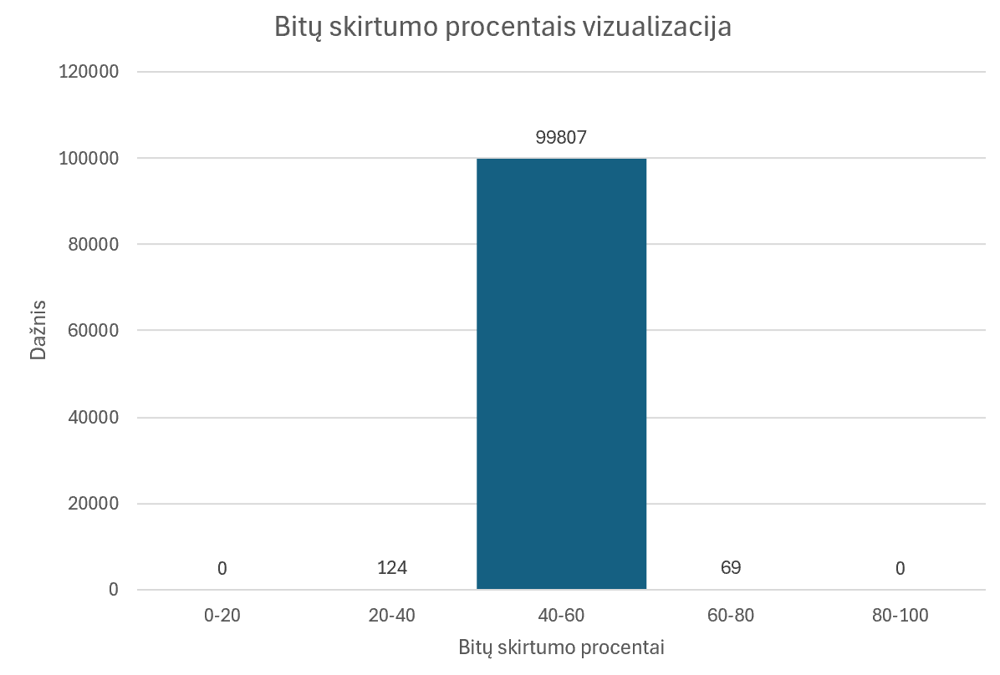
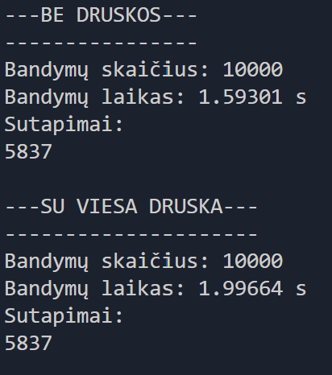
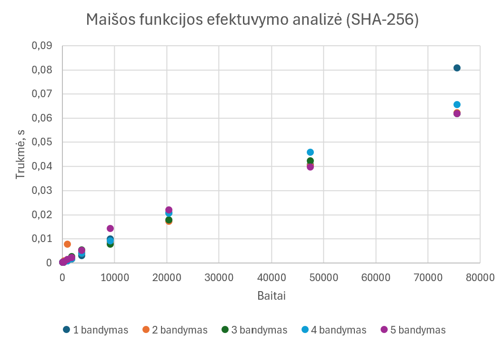
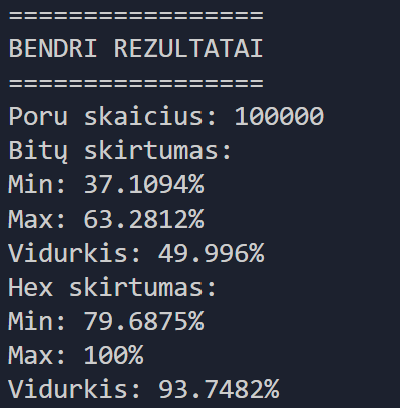

## Programos paleidimas

### 1. Paruošk failus

Projekto aplanke turi būti šie failai:
- *konstitucija.txt* - ketvirtam eksperimentui reikalingas įvesties failas
- Kiti įvesties failai, reikalingi testams

### 2. Paleidimas

1. Raskite **run.bat** failą (jis turi būti pagrindiniame projekto kataloge)
2. Paleiskite **run.bat** failą
- *1 variantas:* dukart spustelėkite failą
- *2 variantas:* atidarykite PowerShell arba Command Prompt, nueikite į projekto katalogą ir įveskite **.\run.bat**

Programa automatiškai:
- sukompiliuos projektą
- paleis programą
- sugeneruos rezultatus


```cpp
FUNCTION HASH(input)

IF input is empty
    RETURN "File is empty"

mask ← 2^256 − 1
hash ← initial hash value

FOR EACH character c IN input

    hash ← hash XOR c

    hash ← (hash × first constant) AND mask

    hash ← hash XOR (hash shifted right by 33 bits)

    hash ← (hash × second constant) AND mask

    hash ← hash XOR (hash shifted left by 17 bits)

    hash ← hash AND mask

    hash ← hash XOR (hash shifted right by 29 bits)

END FOR

hash ← hash AND mask

result ← convert hash to hexadecimal

pad result with leading zeros until it is 64 characters long

RETURN result

END FUNCTION
```

Funkcijos generuojamas maišos kodo ilgis - 64 hex simboliai, 256 bitai. *Enter* simbolis nėra įtraukiamas, nes naudojamas getline.

## 1 eksperimentas


Kaip matome, simbolis *Enter* maišos reikšmei įtakos neturi, nes naudojama getline funkcija nuskaito simbolius iki eilutės pabaigos, tačiau paties *Enter* simbolio į eilutę neįtraukia. Tuo tarpu tarpai prieš tekstą ar po jo pakeičia įvestį, todėl pasikeičia ir galutinė maišos reikšmė. Taip pat net ir nedidelis simbolių pakeitimas, pavyzdžiui, dviejų raidžių sukeitimas vietomis, lemia visiškai kitokią maišos reikšmę.

## 2 eksperimentas


Kaip matome, kiekvienu atveju išlaikomas tas pats 64 hex simbolių (256 bitų) formatas.

## 3 ekperimentas

Rankiniu būdu kelis kartus apskaičiuojant to paties failo maišos reikšmę, gaunamas tas pats rezultatas. Taip pat, apdorojant failus seka *A → B → A*, pirmojo ir trečiojo skaičiavimo rezultatai sutampa.

Tai parodo, kad maišos funkcija yra *deterministinė*: tai pačiai įvesčiai visada gaunama ta pati maišos reikšmė, nepriklausomai nuo to, kada ir kiek kartų funkcija buvo iškviesta.

## 4 eksperimentas

### Teisingumo lentelė

| Eilučių skaičius | Maišos rezultatas |
| -------- | -------- |
| 1 | 1caf7430b3aa7f13b4034ef636543af9ae30a3fa4f509fac67cf77b709050065 |
| 2 | 54f3d00a81b0b25ab2be1f304b84eeed690d3bb54e13df389e50987acc7dccf6 |
| 4 | 7ee4209b6d7ce6f01239f560b9e98ecf66304a5d6729e4929ea77a9c2dbb6ebe |
| 8 | 438c5a58020d1b48b4bc58aba2179468b666d0aebb918281eea5b571af579905 |
| 16 | 3608afb6d6053642a47c0aa93605e81744a89c60ba4886d9d13b2739451cf505 |
| 32 | 3342354f217f4808cc9889b5cad27d84c715793f278e64891643682caf29729f |
| 64 | 453c00e3fd457b00168ef2f16b97c7e33bcb2357290b26c78cc121865877e711 |
| 128 | 5b1383b710c7f73d610b0967aa1b8117f8bd4a5d96061c4e12f8b9baa1e20d30 |
| 256 | 315fd91b4b575a166f9da6aeb482b9cbba587beb4de0365c094d6f8e411c25e6 |
| 512 | 32fbd6d105c9e1ef7dd1fa94421c08e2f610479b877d9677dcc56113df048bb1 |
| 789 | 58bd276594c77f8f7300fe64e2ff183d930c3150cff739ef73fbf4842cd95d4b |

### Laiko matavimų lentelė

| Eilučių skaičius | Baitai | Trumpiausias laikas (s) | Ilgiausias laikas (s) | Vidutinė trukmė (s) |
| -------- | -------- | -------- | -------- | -------- |
| 1 | 70 | 0,0006313 | 0,0010655 | 0,0007701 |
| 2 | 123 | 0,000709 | 0,0009589 | 0,0007813 |
| 4 | 205 | 0,001132 | 0,0019375 | 0,0013601 |
| 8 | 362 | 0,0023805 | 0,003668 | 0,0028496 |
| 16 | 996 | 0,0091453 | 0,0159237 | 0,0119673 |
| 32 | 1841 | 0,0183865 | 0,0221092 | 0,0202995 |
| 64 | 3712 | 0,0501752 | 0,0623083 | 0,0571511 |
| 128 | 9155 | 0,216739 | 0,27379 | 0,238002 |
| 256 | 20409 | 0,957483 | 1,10395 | 1,0174212 |
| 512 | 47434 | 4,70081 | 4,98354 | 4,809124 |
| 789 | 75595 | 11,5421 | 11,887 | 11,7062 |



Kaip matome iš grafiko, mažų įvesčių atveju laikas beveik nesiskiria, tačiau didėjant įvesčių apimčiai, pradeda ryškiai augti. Taip pat matome, jog visi penki matavimai yra labai panašūs, vienintelis pastebėjimas, jog vieno testo metu vienos eilutės maišos funkcijos vykdymo trukmė buvo ilgesnė nei dviejų eilučių.

### v0.2 versijos testai



Kaip matome, po programos patobulinimo DI, efektuvymas labai stipriai padidėjo, didelių failų atveju programa pasidarė net iki 100 kartų efektyvesnė.

## 5 eksperimentas

Atsitiktinių eilučių generatoriui naudotas std::mt19937_64, pradinė reikšmė (seed) – 123456789ULL. Tokios seed naudojimas garantuoja, jog kiekvieną kartą paleidus programą bus sugeneruotos tos pačios sekos. Tai užtikrina, jog kiekvieną kartą paleidus programą, turėtume gauti tą patį rezultatą (galime užtikrinti atsitiktinumą pakeičiant seed). Abėcėlę sudarė 62 ASCII simboliai: A-Z, a-z, 0-9.


Ilgų įvesčių eksperimente kolizijų nerasta, tačiau tai savaime neįrodo maišos funkcijos kriptografinio saugumo. Kadangi naudojama 256 bitų išvestis, atsitiktinės kolizijos tikimybė esant eksperimente naudojamam įvesčių kiekiui yra itin maža. Todėl nulinis kolizijų skaičius yra tikėtinas net ir funkcijai, kuri gali turėti kitų kriptografinių silpnybių. Šis eksperimentas parodo tik tai, kad kolizijų nepavyko aptikti konkrečiame testuotame įvesčių rinkinyje.

## 6 eksperimentas

Lavinos efektas tikrina, kas atsitinka, kai labai mažai pakeiti įvestį. 




Eksperimento rezultatai leidžia įvertinti, kaip pasklidę išvesties bitų pokyčiai po nedidelio įvesties pakeitimo. Kuo daugiau išvesties bitų pasikeičia, tuo stipresnis stebimas lavinos efektas.

Kadangi šio tyrimo metu bitų skirtumo vidurkis yra apie 50%, lavinos efektas yra pakankamai geras.

Geras lavinos efektas savaime nereiškia, jog hash funkcija yra atspari kolizijoms. Tai yra du skirtingi hash funkcijos požymiai. Atsparumą kolizijoms geriausiai atskleidžia prieš tai buvęs (5) eksperimentas.

### v0.2 versijos testai


Kaip matome, mažesnės apimties poroms lavinos efektas yra pastebimai prastesnis, tačiau bendras vidurkis yra panašus.

## 7 eksperimentas

Atliktas eksperimentas parodė, kaip druskos (salt) naudojimas keičia galimybę rasti pradinę įvestį, kai kandidato aibė yra nedidelė ir vieša.



Kaip matome, viešos druskos naudojimas sulėtino skaičiavimus. Kadangi druska yra žinoma užpuolikui, ji pati savaime nepadaro mažos kandidatų erdvės neperrenkamos – užpuolikas vis tiek gali apskaičiuoti maišą kiekvienam iš 10 000 kandidatų. Tačiau svarbus skirtumas yra tas, kad skirtingoms druskoms gaunamos skirtingos maišos, todėl anksčiau apskaičiuoto kandidatų → maišų žemėlapio nebegalima tiesiogiai pakartotinai panaudoti kitam taikiniui su kita druska. Taigi druska ypač apsunkina iš anksto apskaičiuotų rezultatų ir didelių paruoštų lentelių naudojimą.

Slapto atsitiktinumo *r* atveju situacija dar labiau pasikeičia. Kol r nežinomas, vien tik pateikta *H(input || r)* reikšmė neleidžia paprastai patikrinti kandidatų, nes nežinoma antra maišos funkcijos įvesties dalis. Atskleidus *r*, galima patikrinti konkretų kandidatą apskaičiuojant *H(candidate || r)* ir palyginant rezultatą su *H(input || r)* reikšme. 

Tai iliustruoja įsipareigojimo (commitment) idėją: pirmiausia paskelbiama maišos reikšmė, o vėliau atskleidžiami duomenys, leidžiantys patikrinti, kam buvo įsipareigota. Tačiau šis eksperimentas savaime neįrodo, kad naudojama maišos konstrukcija saugiai slepia pranešimą arba neleidžia jo vėliau pakeisti.

### v0.2 versijos testai


Kaip matome, v0.2 versijos hash funkcija druskos eksperimentą atliko kur kas greičiau.

**Tie eksperimentai, kurių v0.2 versijos rezultatai nebuvo paminėti, turėjo tokius pačius rezultatus.**

## Palyginimas su SHA-256 algoritmu



Kaip matome, SHA-256 funkcija yra spartesnė, tačiau matome ir truputį daugiau sklaidos negu savo sukurtoje funkcijoje.



Kaip matome, lavinos efekta yra truputį geresnis.

## Dirbtinis intelektas padėjo:
- Suprasti hash funkcijos principą
- Padaryti v0.2 versiją
- Pildyti README failą

